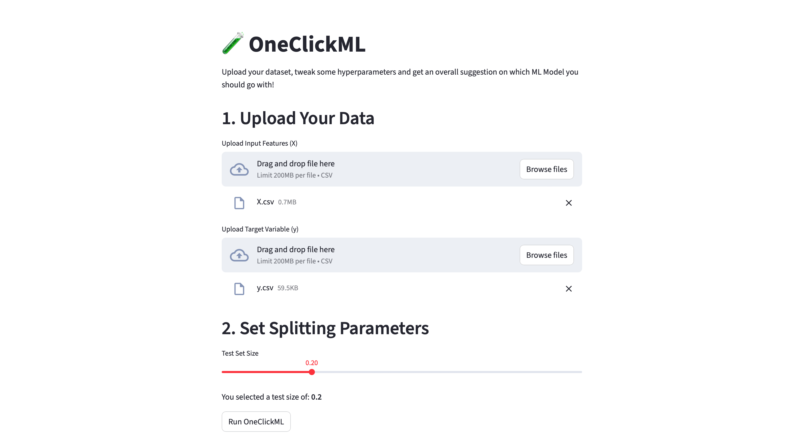

# OneClickML
A Python Library which can train your specific dataset using Multiple Machine Learning models at a time, This Library outputs suggestion on which model to choose &amp; with which parameters! 

### This Library can Run Models like:
#### Regression:
1) Linear Regression
2) Decision Tree Regression
3) MLP Regressor
4) GBM Regressor
5) RF Regressor
6) SVM Regressor

#### Classification:
1) Logistic Regression
2) Decision Tree Classifier
3) MLP Classifier
4) GBM Classifier
5) RF Classifier
6) SVM Classifier

To use OneClickML Prototype, Visit: https://oneclickmlapp.streamlit.app



### How to use OneClickML for custome data?

Step 1 -> Separate the data & make them ready for training (this can involve, Data Manipulation, Feature Engineering etc. :
```
data = pd.read_csv("path_of_your_dataset")
X = data.drop('label', axis=1)
y = data.label
X_train, X_test, y_train, y_test = train_test_split(X, y, test_size=0.2)

seed = 17

```
### The Above Step is done automatically by OneClickML in __2. Set Splitting Parameters__

Step 2 -> Make a list of the model you want to run, form a for loop & call "ModelTraining" Class then ".run_models()" Methods to get Results :) (Example is below)
```
#for running ALL models in a single iteration:
model_list = ['linear','DT','MLP','GBM','RF','SVM']

#for running single model in a single iteration
# model_list = ['linear']

all_results = []

for alg in model_list:
    model = ModelTraining(X, y)
    perf = model.run_models(X_train, y_train, alg, seed=seed, X_test=X_test, y_test=y_test, binary=False)
    all_results.append(perf)

results_df = pd.DataFrame(all_results)
print("\nModel Performance Summary:\n")
print(results_df)

if results_df['Model'][0]=='Linear Regression':
    print(f'\nOneClickML Recommeds "{results_df.loc[results_df['MSE Score'].idxmin(), 'Model']}" Model with Minimum score: {min(results_df['MSE Score'])}')
else:
    print(f'\nOneClickML Recommeds "{results_df.loc[results_df['ROC Score'].idxmin(), 'Model']}" Model with Minimum score: {min(results_df['ROC Score'])}')

```
### These steps will be running in background when you click __Run OneClickML__


Working of "OneClickML" Library:


